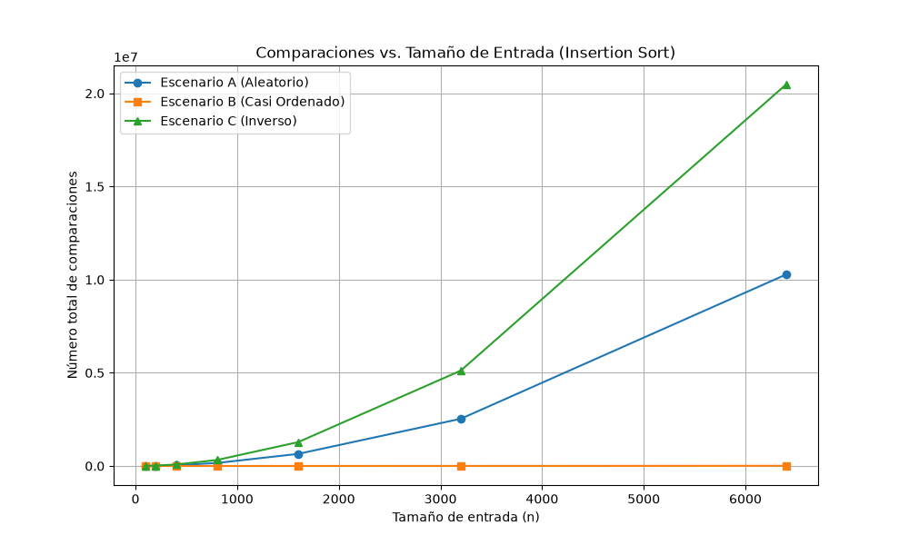
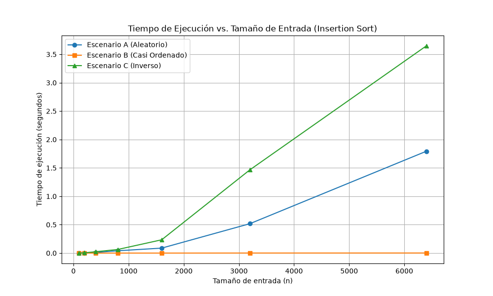
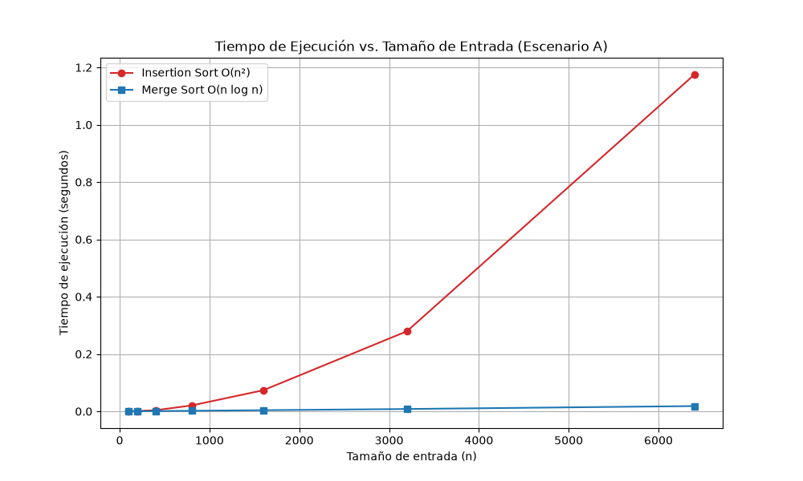

## Parte 1 — Analizar el algoritmo antes de comprar hardware

La corrección de un algoritmo solamente nos asegura que la ejecución cumple con el objetivo esperado al transformar cualquier entrada válida en la salida requerida. En el caso de la plataforma Tamiza, esto significa que el código actual con insertion sort cumple su propósito básico que es procesar la lista de pacientes y organizarla de mayor a menor riesgo. Sin embargo, la corrección matemática de este proceso no asegura su viabilidad operativa.La eficiencia mide cómo un sistema usa sus recursos para cumplir con un límite. En esta plataforma, lo importante es el tiempo de ejecución y el límite es la ventana de cuatro horas, entre las 2:00 a. m. y las 6:00 a. m.Un algoritmo puede entregar un resultado perfecto, pero si su diseño le impide procesar los 1.200.000 registros antes de que el centro de contacto inicie su jornada, fracasa en su entorno de producción.

Duplicar la velocidad del reloj del servidor es una solución engañosa porque ataca el síntoma temporal, pero ignora la naturaleza del crecimiento matemático del algoritmo. El ordenamiento por inserción tiene un comportamiento cuadrático (O(n^2)) en su peor caso. Esto implica que a medida que la cantidad de registros (n) aumenta, el trabajo computacional se dispara en una proporción geométrica, cuadruplicándose cada vez que la entrada se duplica. Si la Secretaría de Salud invierte en un servidor el doble de rápido, los tiempos se reducirán temporalmente a la mitad, pero cuando el volumen de datos del departamento vuelva a crecer, la curva cuadrática del algoritmo absorberá muy rápido la nueva capacidad de hardware, y esto hará que se desborde nuevamente la ventana operativa. 

Un ejemplo de por qué un algoritmo correcto resulta inviable, es un desarrollo de segmentación de imágenes de cámara web mediante clustering que realice para el primer parcial de  la Electiva de Machine Learning. En ese sistema, el algoritmo procesa matrices bidimensionales calculando agrupaciones de píxeles en tiempo real. Si en esa aplicación se implementa un modelo de clustering jerárquico estándar (su crecimiento suele ser cúbico, O(n^3)), el algoritmo logrará una segmentación matemáticamente perfecta de las imágenes. Sin embargo, fallará en la restricción de latencia máxima, ya que, al tener que analizar una resolución estándar en una ventana de apenas 33 milisegundos para mantener 30 cuadros por segundo, el algoritmo tardará segundos o minutos por fotograma, lo que congelaría el video y volvería el sistema inútil para la interacción en vivo.

## Parte 2 — Responsabilidad ambiental y ética de la implementación

El tiempo de ejecución prolongado de un algoritmo ineficiente de complejidad O(n^2)  mantiene la CPU del servidor operando al límite de su capacidad térmica y de procesamiento. Esto demanda un flujo masivo y constante de energía eléctrica, tanto para alimentar el procesador como para los sistemas de refrigeración del centro de datos.

Al ejecutarse todas las madrugadas durante años, este desperdicio se acumula. Un proceso que tarda cuatro horas diarias consumirá más de 1.400 horas de energía al año. Si el volumen de datos sigue creciendo, el consumo se multiplicará sin control, lo que generaría una huella de carbono muy grande.  Además, esto podría evitarse completamente implementando un algoritmo óptimo que resuelva la tarea en minutos.
Asimismo, el fallo de este sistema perjudica a personas concretas, por ejemplo cuando hay retraso en la atención médica crítica, ya que, si el archivo no está listo y se posponen las llamadas, una persona con síntomas graves no recibe orientación médica a tiempo. El costo directo de este error lo asume el paciente, quien paga las consecuencias con el deterioro irreversible de su salud o incluso con su vida cuando tienen algo muy grave. Otro ejemplo es el caso de Parálisis operativa y estrés laboral, puesto que, si el centro de llamadas inicia turno a las 6:00 a. m. sin la base de datos procesada, los trabajadores no pueden ejecutar sus funciones. Este costo lo asume el operador del centro de contacto, quien sufre el estrés de la acumulación del trabajo, y la Secretaría de Salud, que asume el costo financiero de tener personal inactivo. Y, es contradictorio que el equipo de desarrollo que causó el problema no asume el costo inmediato de la crisis operativa.

Ahora, en la plataforma Tamiza, el orden de la lista no es solamente un ejercicio de organización de datos; es un sistema de clasificación que decide quién recibe atención primero.
Entonces, esto nos pone una obligación ética inevitable sobre la corrección del ordenamiento, mucho más allá del tiempo de ejecución. El algoritmo no solo debe ser rápido, sino matemáticamente seguro y estable. Un error lógico en el código que mueva a un paciente de alto riesgo al fondo de la lista deja de ser un simple bug de software para convertirse en un acto de negligencia que vulnera el derecho fundamental a la salud. 

## Parte 3 — Peor caso, mejor caso y caso promedio, demostrados en Python

## 3.1 - Explicación 

**Definición casos:**

**Peor caso:** Es el máximo tiempo de ejecución posible evaluado sobre todas las entradas posibles de un tamaño fijo n. Este representa la cota superior del algoritmo.

**Mejor caso:** Es el mínimo tiempo de ejecución posible evaluado sobre todas las entradas de un tamaño fijo n. Este representa el escenario más favorable.

**Caso promedio:** Es el valor esperado o promedio del tiempo de ejecución sobre todas las entradas posibles de tamaño n. En este análisis se asume una distribución de probabilidad sobre las entradas, considerando que todas las permutaciones tienen la misma probabilidad de ocurrir.

## ¿Cuál de los tres casos usaría para decidir si el algoritmo de Tamiza entra en producción, sabiendo que la ventana de cuatro horas es estricta, y por qué?

Para decidir si el algoritmo de Tamiza entra en producción con una ventana estricta de cuatro horas, se debe utilizar el peor caso.  Esto debido a que, al tener  una restricción operativa estricta e intocable, que es que el centro de llamadas abre a las 6:00 a. m, garantizar el servicio nos exige asegurar que el tiempo máximo absoluto no supere esa ventana. Si por ejemplo, la decisión se basara en el caso promedio o el mejor caso, el sistema fallaría en las madrugadas donde el orden de los datos entrantes se aproxime a la peor configuración posible.

## Predicción 

Teniendo en cuenta que la plataforma Tamiza debe ordenar los registros de mayor a menor riesgo, mediante insertion sort. Asi se verían los escenarios:

El Escenario A (Aleatorio) representa el caso promedio. Con elementos dispuestos al azar, cada registro nuevo deberá desplazarse estadísticamente la mitad de las posiciones hacia atrás, ubicándose entre el mejor y el peor caso en una curva cuadrática.

El Escenario B (Casi ordenado) es el mejor caso. Al estar el 98% en el orden correcto, el bucle interno de insertion sort se detiene inmediatamente tras la primera comparación en la gran mayoría de las iteraciones, lo que acerca el desempeño a un comportamiento lineal O(n).

El Escenario C (Orden Inverso) es el peor caso. Como los datos llegarán en orden ascendente, el algoritmo tendrá que desplazar cada elemento nuevo hasta el extremo opuesto del arreglo, lo que forzará la máxima cantidad de comparaciones posibles en cada iteración.

## Gráficas

## Parte 4 — Complejidad de merge sort e insertion sort: cálculo y validación

[Código de la Parte 4](parte4_complejidad.py) | [Módulo de Algoritmos](algoritmos.py)

### 4.1 — Cálculo teórico

#### Recurrencia de Merge Sort

El algoritmo Merge Sort divide recursivamente el arreglo por la mitad hasta llegar a subarreglos unitarios y luego los combina de forma ordenada. Su ecuación de recurrencia es:

T(n) = 2T(n/2) + \Θ(n)

* **2T(n/2)**: Es la fase de división y conquista. El problema original de tamaño n se divide en 2 subproblemas independientes de tamaño n/2 cada uno.
* **\Θ(n)**: Es la fase de combinación. Para intercalar dos listas ordenadas de tamaño n/2 en una lista única de tamaño n, el algoritmo recorre secuencialmente ambos subarreglos realizando como máximo n-1 comparaciones y n inserciones, lo que genera un costo  lineal en n.

#### Resolución por el Método Maestro

Aplicamos el Teorema Maestro para recurrencias de la forma T(n) = aT(n/b) + f(n):

1. **Identificación de parámetros:** a = 2, b = 2, y la función de combinación f(n) = \Θ(n).

2. **Cálculo del límite crítico:** 
   n^{\log_b a} = n^{\log_2 2} = n^1 = n

3. **Verificación de condiciones:** Comparamos f(n) con n^{\log_b a}. Como f(n) = \Θ(n) y n^{\log_b a} = n, tenemos que f(n) = \Θ(n^{\log_b a}).

4. **Aplicación del Caso 2:** Cumple explícitamente el Caso 2 del Método Maestro, el cual establece que si f(n) = \Θ(n^{\log_b a}), 
entonces:
   T(n) = \Θ(n^{\log_b a} \log n) = \Θ(n \log n)

#### Cálculo de cota para Insertion Sort 
Analizamos el peor caso, que es el arreglo ordenado en sentido inverso, sobre la implementación de insertion_sort. En este escenario, el bucle while se ejecuta i veces en la iteración i, más 1 evaluación adicional para detectar la condición de parada. Sea t_i = i + 1 las evaluaciones del ciclo while:

| Línea de código | Costo unitario | Repeticiones en el Peor Caso |
| :--- | :---: | :---: |
| `for i in range(1, n):` | c_1 | n |
| `key = arr[i]` | c_2 | n - 1 |
| `j = i - 1` | c_3 | n - 1 |
| `while j >= 0:` | c_4 | \sum_{i=1}^{n-1} (i + 1) = \frac{n(n+1)}{2} - 1 |
| `comparaciones += 1` | c_5 | \sum_{i=1}^{n-1} i = \frac{n(n-1)}{2} |
| `if arr[j] < key:` | c_6 | \sum_{i=1}^{n-1} i = \frac{n(n-1)}{2} |
| `arr[j + 1] = arr[j]` | c_7 | \sum_{i=1}^{n-1} i = \frac{n(n-1)}{2} |
| `j -= 1` | $c_8 | \sum_{i=1}^{n-1} i = \frac{n(n-1)}{2} |
| `arr[j + 1] = key` | c_9| n - 1|

**Explicación del resultado:**
Sumando los costos multiplicados por sus repeticiones se obtiene una función cuadrática T(n) = A n^2 + B n + C, donde el término de mayor orden está dominado por la suma aritmética \sum_{i=1}^{n-1} i = \frac{n^2 - n}{2}. Al conservar solo el término dominante y omitir constantes multiplicativas, concluimos que la cota asintótica de Insertion Sort en el peor caso es O(n^2).

#### Tabla Resumen de Complejidades

| Algoritmo | Mejor Caso | Caso Promedio | Peor Caso |
| :--- | :---: | :---: | :---: |
| **Insertion Sort** | O(n) | O(n^2) | O(n^2) |
| **Merge Sort** | O(n \log n) | O(n \log n) | O(n \log n) |

---

### 4.2 — Validación experimental

#### Análisis de la Gráfica Comparativa
La gráfica experimental confirma de forma contundente la divergencia entre ambos algoritmos a medida que crece el tamaño de entrada $n$ sobre el Escenario A (Aleatorio):

1. **Comportamiento de Insertion Sort:** La curva roja muestra una marcada concavidad hacia arriba característica del crecimiento cuadrático $O(n^2)$. Mientras que para $n = 100$ el tiempo es casi imperceptible, al escalar a $n = 6400$ el tiempo de ejecución alcanza aproximadamente $1,18$ segundos.
2. **Comportamiento de Merge Sort:** La curva azul se mantiene prácticamente pegada al eje horizontal a lo largo de toda la prueba. Para $n = 6400$, Merge Sort resuelve el ordenamiento en tan solo $0,02$ segundos.
3. **Conclusión empírica:** Merge Sort es muy superior para la plataforma Tamiza. A la altura de $n = 6400$, Merge Sort resulta ser aproximadamente **59 veces más rápido** que Insertion Sort.

#### Contraste con el Cálculo Teórico

El resultado experimental coincide de forma exacta con la teoría desarrollada en la sección 4.1. Para valores pequeños ($n \le 200$), la diferencia absoluta entre ambos algoritmos es de pocos milisegundos debido al overhead de las llamadas recursivas en Merge Sort. Sin embargo, cuándo $n$ sobrepasa los 800 elementos, el término dominante $n^2$ de Insertion Sort supera exponencialmente al término $n \log n$ de Merge Sort, validando empíricamente la cota matemática.

---

### 4.3 — Concepto técnico a la Secretaría de Salud

Se recomienda de manera definitiva migrar el núcleo de procesamiento de la plataforma Tamiza de **Insertion Sort** a **Merge Sort**. Dado que el canal de entrada de registros es dinámico y propenso a cambios no notificados en los flujos de reproceso, el sistema no puede depender de una implementación que asuma una distribución de datos óptima. Merge Sort garantiza un tiempo de ejecución acotado a $O(n \log n)$ en todos los escenarios (mejor, promedio y peor caso), eliminando el riesgo operativo de mantener múltiples algoritmos en el entorno de producción.

A partir de los datos medidos en el entorno de prueba para el Escenario A ($n = 6400$), realizamos una extrapolación matemática para evaluar que tan posible sería procesar el volumen operativo proyectado de $1.200.000$ registros en la ventana estricta de cuatro horas ($14.400$ segundos):

* **Algoritmo Actual (Insertion Sort):** Con un tiempo medido de $1,18$ segundos para $n = 6400$, el coeficiente cuadrático estimado es $c \approx 2,88 \times 10^{-8}$. Extrapolando para $N = 1.200.000$, la ejecución requeriría aproximadamente **$41.472$ segundos ($\approx 11,52$ horas)** (este valor es una estimación basada en la cota $O(n^2)$ y no una medición directa).*
* **Algoritmo Recomendado (Merge Sort):** Con un tiempo medido de $0,02$ segundos para $n = 6400$, el coeficiente constante estimado es $c \approx 2,47 \times 10^{-7}$. Extrapolando para $N = 1.200.000$ con $N \log_2 N$, la ejecución finalizaría en aproximadamente **$6$ segundos**.

El algoritmo actual excede la ventana operativa en un $188\%$, mientras que Merge Sort cumple el requerimiento, procesando el lote completo en pocos segundos.

Se rechaza la propuesta de adquirir un servidor con el doble de velocidad como solución al problema de desempeño. En las mediciones para $n = 6400$ (extraídas de la gráfica `parte4_tiempo.png`), Insertion Sort registró $1,18$ segundos. Al duplicar la velocidad del hardware, ese tiempo se reduciría a la mitad ($0,59$ s). Sin embargo, al extrapolar este incremento de potencia a $1.200.000$ registros, el tiempo de procesamiento bajaría de $11,52$ horas a aproximadamente **$5,76$ horas**. 

Esto demuestra cuantitativamente que el hardware adicional es ineficaz, incluso con el servidor del doble de velocidad, el proceso excede la ventana de cuatro horas. La aceleración física de factor constante $2$ es matemáticamente incapaz de absorber el crecimiento exponencial de un algoritmo de complejidad $O(n^2)$.

Adicionalmente, se tienen las siguientes consideraciones técnicas:
* **Consumo de Memoria:** Merge Sort requiere un espacio auxiliar de $O(n)$ memoria debido a la creación de subarreglos durante la mezcla, a diferencia del espacio $O(1)$ de Insertion Sort. No obstante, para $1.200.000$ registros de números enteros, la memoria RAM requerida es inferior a $10$ MB, lo cual es despreciable en servidores modernos.
* **Estabilidad y Mantenibilidad:** Merge Sort conserva la estabilidad en la ordenación, lo que garantiza que registros con el mismo índice de riesgo mantengan su orden de llegada original. Además, mantener un único algoritmo robusto reduce drásticamente los costos de mantenimiento de software.